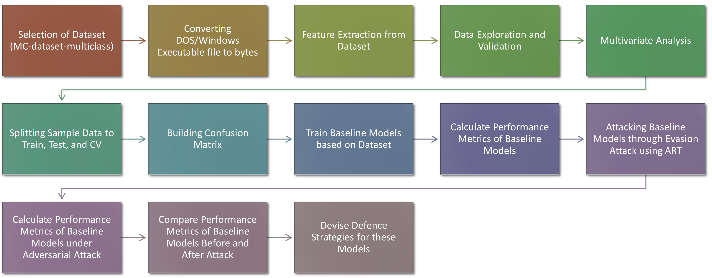

# Calculating Robustness of Malware Detection Models Using Adversarial ML


## Introduction
In this project, we'll be working with real malware and cleanware samples<sup>[1]</sup> which are in DOS/Windows executable (application/x-ms-dos-executable) format. The distribution of samples is as mentioned below:

| Malware Type | Count | Notes |
| --- | --- | --- |
| Backdoor | 3290 |
| Rootkit | 3290 |
| Trojan | 3290 |
| Virus | 3290 |
| Worm | 3290 |
| Cleanware | 3290 | Clean samples |
| __Total__ | 19740 | |

Here, we aim to check the accuracy of malware detection models in identifying the malware and cleanware samples and then under adversarial attacks. By comparing the accuracy of models under these two conditions, we will see which ML model is more vulnerable to adversarial attacks resulting in compromised accuracy and increase in false positive rates.


## Dependencies
This project is built using *__Python v3.10.12__* and *__Jupyter Notebook v7.1.0__*. VSCode is used as the text editor.

Below is the list of libraries used in this project:

| Libraries | Version |
| --- | --- |
| Pandas | v2.2.0 |
| Seaborn | v0.13.2 |
| NumPy | v1.26.4 |
| Scickit Learn | v1.4.1.post1 |
| Adversarial Robustness Toolbox (ART) | v1.17.1 |


Other python packages used:

| Packages | Version |
| --- | --- |
| os | v3.10.12 |
| tabulate | v0.9.0 |
| warnings | v3.10.12 |

You can install the dependencies using this command: ```pip install -r requirements.txt```.


## How to run?
From the __notebook__ folder, run the notebooks in following order:
>1. data_preprocessing.ipynb
>2. model_training.ipynb
>3. evasion_attack.ipynb

To run all the three notebooks together, run the notebook ```run_all.ipynb```. This will execute all the notebooks in the sequence mentioned above. 

Alternatively, you can run these notebooks from browser on ```http://localhost:8888/```. Please check Jupyter configuration using ```jupyter notebook --generate-config```. Refer the quick guide [The five-minute guide to setting up a Jupyter notebook server](https://lerner.co.il/2017/02/01/five-minute-guide-setting-jupyter-notebook-server/) to setup and start Jupyter local server.

__Note:__ Since we are dealing with real malware samples, please be careful while unpacking the file onto your system. Since Windows system will not support the download of these files, we have used Ubuntu v22.04.3 in a sandbox environment.


## Methodology


### Part 1: Data Preprocessing (data_preprocessing.ipynb)
Following things were done after dataset selection:
1. Convertion of DOS/Windows executable to bytes (in .txt format)
2. Feature extraction from dataset
3. Data Exploration and Validation
4. Multivariate Analysis
5. Splitting dataset to Train, Test, and Cross-Validation (CV)
6. Building Confusion Matrix

### Part 2: Model Training (model_training.ipynb)
Next step after data preprocessing is training our models. For this experiment, we have selected below models for analysis:
1. Logistic Regression
2. Decision Tree Classifier
3. Random Forest Classifier

We are using the training dataset created in Part 1 to train our models mentioned above.

### Part 3: Adversarial Attack on Models (evasion_attack.py)
Now that our models are trained, we can perform adversarial attack on the models. We have used the technique of __Evasion Attack__ on the models for which we have used below attack techniques:
1. __Basic Iterative Method (BIM)__ - Used on Logistic Regression
2. __Zeroth Order Optimization (ZOO)__ - Used on Decision Tree Classifier and Random Forest Classifier

BIM, also called extended Fast Gradient Sign Method (FGSM), is generally more effective at crafting adversarial examples compared to FGSM. The iterative nature of BIM allows it to find adversarial perturbations that are smaller but still effective, making the adversarial examples harder to detect or defend against.

The ZOO attack is a method used in adversarial ML to craft adversarial examples without directly accessing the gradient information of the target model. In ZOO, the algorithm estimates the gradient of the loss function without actually computing it directly. ZOO uses this concept to iteratively perturb the input to generate adversarial examples. It does this by querying the target model multiple times with slightly perturbed inputs and using its responses to estimate the gradient direction.


## Results
The table below shows the performance metrics of the models before adversarial attack:

| Model | Accuracy | Precision | Recall | F1 Score |
| --- | --- | --- | --- | --- |
| Logistic Regression | 0.38883 | 0.452153 | 0.38883 | 0.368111 |
| Decision Tree Classifier | 0.635521 | 0.6354 | 0.635521 | 0.635263 |
| Random Forest Classifier | 0.754897 | 0.746574 | 0.754897 | 0.754524 |

The table below shows the performance metrics of the models after adversarial attack:

| Model | Accuracy | Precision | Recall | F1 Score |
| --- | --- | --- | --- | --- |
| Logistic Regression | 0.150844 | 0.114083 | 0.150844 | 0.11552 |
| Decision Tree Classifier | 0.531591 | 0.548717 | 0.531591 | 0.535043 |
| Random Forest Classifier | 0.661925 | 0.670772 | 0.661925 | 0.664535 |


## References
[1] E. de O. Andrade, “MC-dataset-multiclass,” Mar. 2018. [Online]. Available: https://figshare.com/articles/dataset/MC-dataset-multiclass/5995468/1

